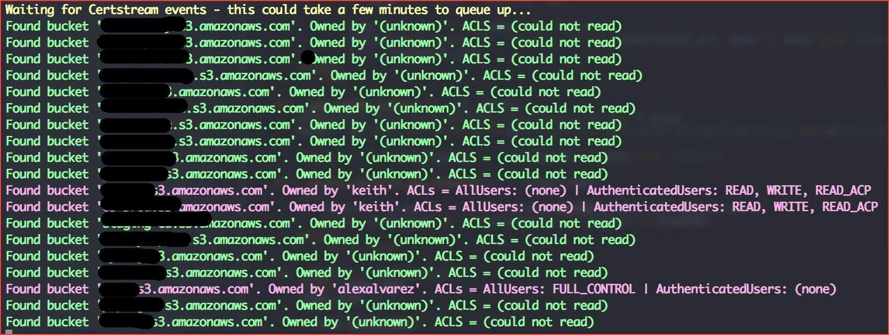

# Attacking & Auditing Cloud Storages


## Introduction

This blog series aims to help you get started with cloud storage security. We will be looking how to attack and audit cloud storage services such as AWS S3, Azure, Google storage/bucket. This blog is aimed at security professionals and companies who want to learn about cloud storage security.

Before moving further we will understand what is s3 bucket and how to create one.

## What is AWS S3 ?

Amazon Simple Storage Service (Amazon S3) is an object storage service that is used to store simple images to large videos, uploading, storing, and accessing these files back.


## How to create an S3 bucket? 

Now let's create an S3 bucket and store some files in it. Login to AWS console and navigate to S3 under Storage services.


Let's create a new bucket here.


After we click on create a bucket and enter a bucket name. Note that the bucket name must be unique.


Click on submit bucket and if the bucket is created we can see it in the s3 dashboard. Now let's upload our first file to the bucket.


Click on the upload button and select the file you want to upload and navigate to the s3 dashboard.


We have successfully created the bucket and uploaded a file into it.
Note that this is not a secure way to create a bucket, our main motto is to get the basic understanding to move on further.
Before moving to check cloud storage security we will configure AWS CLI which can be used later to explore the buckets.

To install AWS CLI you can refer to the [official website](https://aws.amazon.com/cli/).

Now to configure the AWS CLI we need AWS credentials i.e Access Key ID & Secret Access Key.

1. log in to your AWS account and click on my security credentials.

    

2. Click on create access key

    

3. Click on Download .csv file or click on show secret access key.

    

4. Now Open your terminal and type the below command and add your access key ID & Secret key.

    `aws configure`

    

We will use AWS CLI in the later section. Let's check out different methods to find the misconfigured buckets.

## Enumeration

AWS s3 buckets can be in different formats  
```
https://[bucketname].s3.amazonaws.com
https://s3-[region].amazonaws/[bucketname]/
https://[bucketname].s3-website-[region].amazonaws.com/
```
The bucket name can be between 3 and 63 characters long and can contain only lower-case characters, numbers, periods, and dashes.
Each label in the bucket name must start with a lowercase letter or number.
The bucket name cannot contain underscores, end with a dash, have consecutive periods, or use dashes adjacent to periods.
The bucket name cannot be formatted as an IP address (198.51.100.24).

Following are the status code for the buckets

    404 – Bucket does not exist
    403 – Access denied (Bucket exists)
    200 – Bucket found

Now we will look at different ways to find the buckets


### Dorks

Google Dorks: 

```
site:s3.amazonaws.com example
site:s3.amazonaws.com example.com
site:s3.amazonaws.com example-com
site:s3.amazonaws.com com.example
site:s3.amazonaws.com com-example
site:s3.amazonaws.com filetype:xls password
site:http://s3.amazonaws.com intitle:index.of.bucket
site:http://amazonaws.com inurl:".s3.amazonaws.com/"
```
Github Dork:

`"example.com" amazonaws.com`

Also, you can use the below projects to find leaks in the GitHub repo.

- [gitleaks](https://github.com/zricethezav/gitleaks) 
- [trufflehog](https://github.com/dxa4481/truffleHog) 

### Bruteforce 

Usually, companies tend to use patterns in naming such as [company-name]-dev or [company-name]-test. If you are targetting to find a particular company's bucket you can brute-force the name of buckets using such patterns.
There are a couple of open-source tools available to automate this process.
Let's find a bucket that we have created earlier using tool [cloud_enum](https://github.com/initstring/cloud_enum) which is a Multi-cloud OSINT tool to enumerate public resources in AWS, Azure, and Google Cloud.

Let's say you were researching "somecompany" whose website is "somecompany.io" 
You could run the tool like this:


`cloudenum.py -k payatu -k payatu.com`


There are also a couple of tools for cloud storage security such as [lazys3](https://github.com/nahamsec/lazys3), [s3-buckets-finder](https://github.com/gwen001/s3-buckets-finder) which can be used to brute force.


### [grayhatwarfare.com](https://buckets.grayhatwarfare.com/)


This is a searchable database of open buckets and We got lucky using this project.


### Certificate transparency logs

[bucket-stream](https://github.com/eth0izzle/bucket-stream)

This tool simply listens to various certificate transparency logs (via certstream) and attempts to find public S3 buckets from permutations of the certificate's domain name.
Execute the below command

`python3 bucket-stream.py`



### JS 

Sometimes js files may leak the bucket of the company which should not be overlooked.

### Burp 

We can use the burp suite to find s3 buckets by simply searching in the history for the keyword `s3` or by adding in the scope. 
You can also use the below regex which we found more useful, we don't know the creator of this.

`[\w\-\.]+\.s3\.?(?:[\w\-\.]+)?\.amazonaws\.com|
(?<!\.)s3\.?(?:[\w\-\.]+)?\.amazonaws\.com\\?\/[\w\-\.]+`

You can use the below burp extensions to identify s3 buckets and their misconfiguration.

- [aws-extender](https://github.com/VirtueSecurity/aws-extender)
- [Burp-AnonymousCloud](https://github.com/codewatchorg/Burp-AnonymousCloud)

### CNAME

The domain could just be an alias of the S3 endpoint name. A CNAME is a special record in the DNS, which maps one domain name to another, referred to as the Canonical Name.

To get the bucket name, we fire up our console and run nslookup against the domain:

```
# nslookup dev.example.com
Server:         8.8.8.8
Address:        8.8.8.8#53Non-authoritative answer:
dev.example.com   canonical name = dev-payatu-example.s3.amazonaws.com<...>
```

S3 bucket name would be the S3 bucket name dev-payatu-example

### Dir listing

If listing objects are enabled for us in the S3 bucket, the name will be disclosed in the `<Name>bucket_name</Name>element`


### %C0 Method

If the domain is pointed to `http://s3.amazonaws.com/[domain]` adding %c0 into the URL may reveal the bucket name.


We have covered almost all the methods to identify s3 buckets. Let's try to exploit the misconfigured buckets.

## Exploitation

We have gathered buckets using almost every source, let's exploit them

We have configured AWS CLI already, we can check buckets ACL by firing the below command.

`aws s3api get-bucket-acl --bucket [bucket-name]`


If you observed the permission, for the bucket owner has full control and for the Everyone (public access) has read permission.

- List

    You can list the objects by using the below command 


    `aws s3 ls s3://[bucket-name] --recursive`

    

    Sometimes there may be a misconfiguration to the public to remove or upload objects, you can check using the below commands.

- Upload
        
    `aws s3 cp secret.txt s3://payatu-dev/secret.txt`

- Remove
        
    `aws s3 rm s3://payatu-dev/secret.txt`

    Now to Download the entire bucket you can use the below command.

- Download 

    `aws s3 sync s3://<bucket-name> <local_destination_path>`

    

## Auditing & Configuration review

Till now we have covered the offensive part, Let's check how to audit and check misconfiguration of the buckets.

### Manual
In this section, we will be talking about common s3 misconfiguration & how to check them.

1. Logging is not enabled.
    
    S3 bucket logging should be enabled which can be useful in security and incident response workflows.

    Steps to check : 

    `aws s3api get-bucket-logging --bucket [bucket-name]`

    

    If the command returns empty output, it means that logging is not enabled.

2. Ensure that your Amazon S3 buckets use the correct policies and are not publicly accessible

    2.1. Amazon S3 Block Public Access feature is not enabled

    Amazon S3 Block Public Access feature should be enabled to restrict public access to all objects.

    Steps to check : 

    `aws s3api get-public-access-block --bucket [bucket-name]`

    

    If the command returns NoSuchPublicAccessBlockConfiguration error message or configuration values all set to false feature is not enabled.

    2.2. Authenticated user has "FULL_CONTROL | READ | READ_ACP | WRITE | WRITE_ACP" access.

    To protect data against unauthorized access AWS S3 buckets should not grant FULL_CONTROL | READ | READ_ACP | WRITE | WRITE_ACP access to authenticated users (i.e. signed AWS accounts or AWS IAM users).

    Steps to check :

    `aws s3api get-bucket-acl --bucket [bucket-name]`

    

    If the Grantee group URI is equal to “http://acs.amazonaws.com/groups/global/AuthenticatedUsers” (Any Authenticated AWS User) and has the READ, WRITE, READ_ACP and WRITE_ACP permissions associated with it, the selected S3 bucket is fully accessible to other AWS users, hence insecure. 

    2.3. Public user have "FULL_CONTROL | READ | READ_ACP | WRITE | WRITE_ACP" access.

    To protect data against unauthorized access AWS S3 buckets should not grant FULL_CONTROL | READ | READ_ACP | WRITE | WRITE_ACP access to the public.

    Steps to check :

    `aws s3api get-bucket-acl --bucket [bucket-name]`

    

    If the Grantee group URI is equal to “http://acs.amazonaws.com/groups/global/AllUsers” and has the READ, WRITE, READ_ACP, and WRITE_ACP permissions associated with it, the selected S3 bucket is fully accessible to the public, hence insecure. 

3. MFA Delete is not enabled.

    MFA Delete can help prevent accidental bucket deletions. If MFA Delete is not enabled, any user with the password of a sufficiently privileged root or IAM user could permanently delete an Amazon S3 object.

    MFA Delete requires additional authentication for either of the following operations:

    - Changing the versioning state of your bucket

    - Permanently deleting an object version

    Steps to check :

    `aws s3api get-bucket-versioning --bucket [bucket-name]`

    

    If the command returns empty output, it means that versioning is not enabled, hence MFA Delete is not enabled.

4. Encryption of data at rest should be enabled.
    
    Server-Side Encryption – Request Amazon S3 to encrypt your object before saving it on disks in its data centers and then decrypt it when you download the objects. Server-side encryption can help reduce risk to your data by encrypting the data with a key that is stored in a different mechanism than the mechanism that stores the data itself.

    Amazon S3 provides these server-side encryption options:

    - Server-side encryption with Amazon S3‐managed keys (SSE-S3).

    - Server-side encryption with customer master keys stored in AWS Key Management Service (SSE-KMS).

    - Server-side encryption with customer-provided keys (SSE-C).

    Client-Side Encryption – Encrypt data client-side and upload the encrypted data to Amazon S3. In this case, you manage the encryption process, the encryption keys, and related tools.

    Steps to check :

    `aws s3api get-bucket-encryption --bucket [bucket-name]`

    

    If the command returns ServerSideEncryptionConfigurationNotFoundError output, it means that encryption is not enabled.

4. Encryption of data in transit should be enabled.

    You can use HTTPS (TLS) to help prevent potential attackers from eavesdropping on or manipulating network traffic using person-in-the-middle or similar attacks. You should allow only encrypted connections over HTTPS (TLS) using the AWS:SecureTransport condition on Amazon S3 bucket policies. 

    Steps to check :

    `aws s3api get-bucket-policy --bucket [bucket-name]`

    

    If the command returns NoSuchBucketPolicy output, it means that encryption of data in transit is not enabled.

5. S3 Object Lock is not enabled.

    Using S3 Object Lock enables you to store objects using a "Write Once Read Many" (WORM) model. S3 Object Lock can help prevent accidental or inappropriate deletion of data. For example, you could use S3 Object Lock to help protect your AWS CloudTrail logs. 

    Steps to check :

    `aws s3api get-object-lock-configuration --bucket [bucket-name]`

    

    If the command returns ObjectLockConfigurationNotFoundError output, it means that object lock is not enabled.

6. Versioning is not enabled.

    Versioning is a means of keeping multiple variants of an object in the same bucket. You can use versioning to preserve, retrieve, and restore every version of every object stored in your Amazon S3 bucket. With versioning, you can easily recover from both unintended user actions and application failures. 

    Steps to check :

    `aws s3api get-bucket-versioning --bucket [bucket-name]`

    

    If the command returns empty output, it means that versioning is not enabled

7. S3 cross-region replication is not enabled.

    Although Amazon S3 stores your data across multiple geographically diverse Availability Zones by default, compliance requirements might dictate that you store data at even greater distances. Cross-region replication (CRR) allows you to replicate data between distant AWS Regions to help satisfy these requirements. CRR enables automatic, asynchronous copying of objects across buckets in different AWS Regions

    Steps to check :

    `aws s3api get-bucket-replication --bucket [bucket-name]`

    

    If the command returns ReplicationConfigurationNotFoundError output, it means that cross-origin replication is not enabled.

### Automation
For this, we will be using [s3audit](https://github.com/scalefactory/s3audit) tool.
Let's explore how to check misconfiguation using this tool.

You can fire up the below command in the console and observe the misconfiguration of s3 bucket.

`s3audit --bucket=s3-bucket=name`


### Why you need to check cloud storage security?
Take a look at the following GitHub repo to discover more about the AWS S3 bucket leaks up to date.

- [s3-leaks](https://github.com/nagwww/s3-leaks)
- [Yet Another S3 Bucket Leak](https://github.com/pbnj/YAS3BL)


### Labs

To learn and practice the attacks related to s3 you can navigate to the below vulnerable sites.

- [flaws.cloud](http://flaws.cloud/)
- [flaws2.cloud](http://flaws2.cloud/)
- [s3game](http://s3game-level1.s3-website.us-east-2.amazonaws.com/)


This concludes our blog. In the next blog, we will be exploring the cloud storage of another cloud service provider.

## References : 

- https://aws.amazon.com/s3/
- https://docs.aws.amazon.com/cli/latest/reference/s3/ls.html
- https://www.cloudconformity.com/knowledge-base/aws/S3/
- https://docs.aws.amazon.com/AmazonS3/latest/userguide/security-best-practices.html

