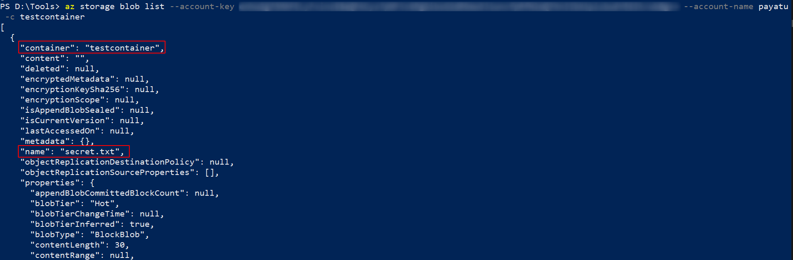
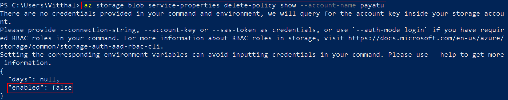
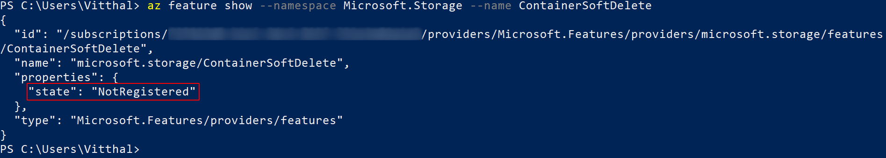

# Azure Storage Security: Attacking & Auditing


Hello Guys,

So, in my last blog, I showed you guys how to get started with [cloud storage security](https://payatu.com/blog/vitthal/cloud-storage-security) & check misconfiguration related to AWS Cloud storage.This will be a multipart blog series where I will be demonstrating how to check for different misconfigurations & vulnerabilities that might be present in cloud storage. In this blog, I will be covering Azure storage attacks.

I have also released a tool to attack azure cloud storages : [Az-Blob-Attacker](https://github.com/VitthalS/Az-Blob-Attacker), you can check it out.

Before moving further, we will understand what Azure storage is and how to create one.

## What is Azure Storage Service?

Azure Storage is Microsoft’s cloud storage solution for modern data storage scenarios. Azure Storage offers a massively scalable object store for data objects, a file system service for the cloud, a messaging store for reliable messaging, and a NoSQL store.

We will now explore & understand different azure storage types:


- Azure File Storage

    File Storage enables you to create network file shares that can be accessed by using SMB (Server Message Block). This is a powerful way to share files with other people in addition to sharing files with read and write access between virtual machines

- Azure Table Storage

    Table Storage is a NoSQL database service. NoSQL means that this database doesn’t have a schema for defining tables like in a relational database instead, table storage provides a Key-Value Store with a schemaless design.
Table storage is ideal for storing structured non-relational data.

- Azure Queue Storage

    Queue storage is used to store a large number of messages.
You can use queue storage as a buffer between your clients and your back-end.
This allows your back-end to process queue messages at its own pace.

- Azure Blob Storage

    Blob Stands for a binary large object, you should use blob storage to store a massive amount of unstructured data like text or binary files, But you can use blobs to store small files as well.
    Blobs can be accessed through http and https.
    You can store static websites that don’t need server-side processing on blobs. For example, you can store a SPA app like angular on a blob.

Blob storage offers three types of resources:

- The storage account
- A container in the storage account
- A blob in a container

The following diagram shows the relationship between these resources.


- Storage accounts

    A storage account provides a unique namespace in Azure for your data. Every object that you store in Azure Storage has an address that includes your unique account name. The combination of the account name and the Azure Storage blob endpoint forms the base address for the objects in your storage account.

    For example, if your storage account is named mystorageaccount, then the default endpoint for Blob storage is:

    http://mystorageaccount.blob.core.windows.net

- Containers

    A container organizes a set of blobs, similar to a directory in a file system. A storage account can include an unlimited number of containers, and a container can store an unlimited number of blobs.

    You can configure a container with the following permissions:

    - No public read access: 
        The container and its blobs are private and can only be accessed by the storage account owner. This is the default for all new containers.
    - Public read access for blobs only: 
        Blobs within the container can be read by any anonymous Internet user. But container data is not available. Anonymous clients cannot enumerate the blobs within the container.
    - Full public read access: 
        All container and blob data can be read by anonymous Internet users. Clients can enumerate blobs within the container by anonymous request, but cannot enumerate containers within the storage account.

For the following URL 

`https://testmystorage101.blob.core.windows.net/testcontainer101/secret.txt`

We can say

    Storage Account Name: testmystorage101
    Container Name : testcontainer101
    Blob Name : secret.txt


Now, we know the basics let's explore how to create one

1. Navigate to [azure portal](https://portal.azure.com/#home) and click on Storage accounts
   
    

2. Click on the '+Add' button and fill in the relevant fields and click on Review+Create.

   
    

3. Now click on '+Container' to create & fill all the relevant fields and click on create.

   
    
4. Navigate to the container we created and click on the 'Upload' button & upload a blob and click on upload.

    

Note that this is not a secure way to create a container. Our main motto is to get the basic understanding to move on further.
Before moving to check azure storage security, we will configure AZ CLI, which can be used later to explore the blobs.

To install AZ CLI, you can refer to the [official website](https://docs.microsoft.com/en-us/cli/azure/).

1. Now to configure the AZ CLI, Open the console and execute the below command

    `az login`

    

2. Navigate to the URL and login into your account.

    

3. You are now logged in.

    

4. Navigate to the Console and observe you are logged in and information related to your account.

    

We will use AZ CLI in the later section. Let's check out different methods to find the misconfigured containers.

## Enumeration

The azure container is in the following format

`https://<storage-account-name>.blob.core.windows.net/<container-name>/`

A container name must be a valid DNS name, conforming to the following naming rules:

- Container names must start or end with a letter or number, and can contain only letters, numbers, and the dash (-) character.
- Every dash (-) character must be immediately preceded and followed by a letter or number; consecutive dashes are not permitted in container names.
- All letters in a container name must be lowercase.
- Container names must be from 3 through 63 characters long.

### Dorks

```
site:github.com web.config "StorageConnectionString" "DefaultEndpointsProtocol"
site:http://blob.core.windows.net
```


Also, you can use the below projects to find leaks in the GitHub repo.

- [gitleaks](https://github.com/zricethezav/gitleaks) 
- [trufflehog](https://github.com/dxa4481/truffleHog) 

### Shodan
`hostname:"core.windows.net"`


### Bruteforce 

Usually, companies tend to use patterns in naming, such as [company-name]-dev or [company-name]-test. If you are targetting to find a particular company's container, you can brute-force the name of the container using such patterns.
There are a couple of open-source tools available to automate this process.
Let's find a container that we have created earlier using tool [cloud_enum](https://github.com/initstring/cloud_enum) which is a Multi-cloud OSINT tool to enumerate public resources in AWS, Azure, and Google Cloud.

Let's say you were researching "somecompany" whose website is "somecompany.io" 
You could run the tool like this:

`cloudenum.py -k payatu -k payatu.com`


We have found our previously created container and blobs stored in it.


- Bruteforce Account

    We are using [Gobuster](https://github.com/OJ/gobuster/) tool to brute-force account names using the DNS module.

    

- Bruteforce Container names

    We are using [ffuf](https://github.com/ffuf/ffuf) tool to brute force container names.

    

- Bruteforce Blob names
  
    To find out valid blob names, simply navigate to the below URL and you will get all the blobs in the container. It will work if the listing is enabled.

    `https://<storage-account-name>.blob.core.windows.net/<container-name>?restype=container&comp=list`

    

You can also use tools like [Microburst](https://github.com/NetSPI/MicroBurst) or [CloudScraper](https://github.com/jordanpotti/CloudScraper) to brute-force the azure storage and containers.


### [grayhatwarfare.com](https://buckets.grayhatwarfare.com/)


This is a searchable database of open buckets.


We have covered almost all the methods to identify Azure Containers. Let's try to exploit the misconfigured storage.

## Exploitation

### Manual

Navigate to the below URL to find out valid blob names.

    `https://<storage-account-name>.blob.core.windows.net/<container-name>?restype=container&comp=list`


Add blob name into URL to see contents of blob.

`https://<storage-account-name>.blob.core.windows.net/<container-name>/<blob-name>`


Let's assume you have found a leaked storage account name and key.

- List

    You can list container names using the storage account name and keys by executing the below command in the console.

    ` az storage container list --account-key <XXXX> --account-name <XXXX>`

    

    You can list blob names using the storage account name, keys, and container name by using the below command.

    ` az storage blob list --account-key <XXXXX> --account-name <XXXX> -c <XXXX>`

    

- Upload

    You can upload blobs using the below command.

    `az storage blob upload --account-key <XXXX> --account-name <XXXX> -c <XXXX> --file '<File-path>' --name <blobname>`

     

- Download

    You can download blobs using the below command.

    ` az storage blob download --account-key <XXXX> --account-name <XXXX> -c <XXXX> --file <XXXX> --name <XXXX>`

      

- Delete
  
    You can delete blobs using the below command.

    `az storage blob delete --account-key <XXXX> --account-name <XXXX> -c <XXXX> --name <XXX>`

      

### Automation

We can automate this whole process using tools.
We are going to open-source the tool [Az-Blob-Attacker](https://github.com/VitthalS/Az-Blob-Attacker) which performs all the operations stated above.


Let's explore this tool

1. Run the tool by executing the below command in the console.

    `python az-blob-attacker.py`

2. To get the container names associated with the storage account, enter number 1.

    

3. To get the blob names associated with the storage account & container, enter number 2.

    

4. To Download all the blobs associated with the storage account & container, enter number 3.

    

5. To upload a blob to the container, enter number 4 and specify the path to the file.

    

6. To delete a blob from a specified container, enter number 5

    


## Auditing & Configuration review

Till now, we have covered the offensive part. Let's check how to audit and check misconfiguration of the container.

### Manual
In this section, we will be talking about common storage misconfiguration & how to check them.

1. Disable anonymous public read access to containers and blobs

    Anonymous public read access to a container and its blobs grants read-only access to those resources to any client. Avoid enabling public read access unless your scenario requires it

    Steps to check : 

    1. List all storage accounts

        ` az storage account list --query '[*].name'`

        

    2. List all containers in a specific storage account
    
        `az storage container list --account-name <XXXX> --query '[*].name'`

        

    3. Check for the public access
       
        `az storage container show --account-name <XXXX> --name <XXXX>`

        

        You can observe that publicAccess is set to container it means anonymous read access for containers and blobs.

2. Limit shared access signature (SAS) tokens to HTTPS connections only

    Requiring HTTPS when a client uses a SAS token to access blob data helps to minimize the risk of eavesdropping.

    Steps to Check : 

    1. Locate the Shared Access Signature (SAS) token defined within the SAS URL provided to your storage account clients. The SAS token starts with a question mark, followed by a set of various parameters.
    
         Example SAS token :
        `?sv=2020-02-10&ss=b&srt=co&sp=rlx&se=2021-03-18T15:10:53Z&st=2021-03-18T07:10:53Z&spr=https,http&sig=<XXXX>%3D`

    2. Identify the spr parameter, for example, spr=https,http.
    
        If it is set to http, it is not compliant.


3. Shared Access Signature Tokens should be expired.

    If a SAS is compromised, you will want to revoke that SAS as soon as possible. To revoke a user delegation SAS, revoke the user delegation key to quickly invalidate all signatures associated with that key. To revoke a service SAS that is associated with a stored access policy, you can delete the stored access policy, rename the policy, or change its expiry time to a time that is in the past.

    Steps to Check : 

    1. Locate the Shared Access Signature (SAS) token defined within the SAS URL provided to your storage account clients. The SAS token starts with a question mark, followed by a set of various parameters.
    
         Example SAS token :
        `?sv=2020-02-10&ss=b&srt=co&sp=rlx&se=2021-03-18T15:10:53Z&st=2021-03-18T07:10:53Z&spr=https,http&sig=<XXXX>%3D`

    2. Identify the parameters `se` & `st`, It should expire within an hour from its creation.

4. Turn on soft delete for blobs
   
    Soft delete for blobs enables you to recover blob data after it has been deleted. 

    Steps to check : 

    1. Run the below command 

        `az storage blob service-properties delete-policy show --account-name <XXXX>`

        

    2. Observe that if enabled is set to false means soft delete is not enabled.

5. Turn on soft delete for containers.

    Soft delete for containers protects your data from being accidentally or maliciously deleted. When container soft delete is enabled for a storage account, any deleted container and its contents are retained in Azure Storage for the period that you specify. During the retention period, you can restore previously deleted containers. Restoring a container restores any blobs within that container when it was deleted.

    Steps to check : 

    1. Run the below command 
       
        `az feature show --namespace Microsoft.Storage --name ContainerSoftDelete`

        

    2. If the command returns the output in-state "NotRegistered", it means the feature is not enabled.

6. Enable Azure Resource lock.
   
    Apply an Azure Resource Manager lock to your storage account to protect the account from accidental or malicious deletion or configuration change. Locking a storage account does not prevent data within that account from being deleted. It only prevents the account itself from being deleted.

    Steps to check : 

    1. Run the below command

        `az lock list`

        

    2. If the command returns empty output, it means that the Azure Resource lock is not enabled.

7. Enable secure transfer (HTTPS) to the storage account

    When you require a secure transfer for a storage account, all requests to the storage account must be made over HTTPS. Any requests made over HTTP are rejected.

    Steps to check : 

    1. Run the below command

        `az storage account show --resource-group <XXXX> --name <XXXX> --query enableHttpsTrafficOnly`

        

     2. If the command returns false output, it means that secure transfer (HTTPS) to the storage account is not enabled.

8. Grant limited access to Azure Storage resources using shared access signatures (SAS)

    A shared access signature (SAS) provides secure delegated access to resources in your storage account. With SAS, you have granular control over how a client can access your data.

    Steps to Check : 

    1. Locate the Shared Access Signature (SAS) token defined within the SAS URL provided to your storage account clients. The SAS token starts with a question mark, followed by a set of various parameters.
    
         Example SAS token :
        `?sv=2020-02-10&ss=b&srt=co&sp=rwdlacx&se=2021-03-18T15:10:53Z&st=2021-03-18T07:10:53Z&spr=https,http&sig=<XXXX>%3D`

    2. Identify the parameters `sp` which has `rwdlacx`, which means this token has Read, Write, Delete, List, Add, Create permission.

9. Regenerate your account keys periodically

    Rotating the account keys periodically reduces the risk of exposing your data to malicious actors.

10. Disallow Shared Key authorization
    
    When you disallow Shared Key authorization for a storage account, Azure Storage rejects all subsequent requests to that account that are authorized with the account access keys. Only secured requests that are authorized with Azure AD will succeed. 

    Steps to check : 

    1. Run the below command

        `az storage account show --resource-group <XXXX> --name <XXXX> --query allowSharedKeyAccess`

        

     2. If the command returns true output, it means that Shared Key authorization is not enabled.

11. Enable firewall rules to access from IP.

    Configure firewall rules to limit access to your storage account to requests that originate from specified IP addresses.

    Steps to check : 

    1. Run the below command

        `az storage account show --resource-group <XXXX> --name <XXXX> --query networkRuleSet`

         

    2. If the command returns empty output, it means that Enable firewall rules to access from IP are not enabled.

12. Limit network access to specific networks

    Limiting network access to networks hosting clients requiring access reduces the exposure of your resources to network attacks.

    Steps to check : 

    1. Run the below command

        `az storage account show --resource-group <XXXX> --name <XXXX> --query networkRuleSet`

         

    2. If the command returns allow in "defaultAction" output, it means that network access to specific networks is not enabled and all networks, including the Internet, can access the selected Azure Storage account

13. Use Customer-managed keys for Azure Storage encryption

    You can use your encryption key to protect the data in your storage account. When you specify a customer-managed key, that key is used to protect and control access to the key that encrypts your data.

    Steps to check : 

    1. Run the below command

        `az storage account show --resource-group <XXXX> --name <XXXX> --query encryption`

        

    2. If the "keyVaultProperties" is set to null then Customer-managed keys for Azure Storage encryption are not used.

### Automation
For this, we will be using the [Azucar](https://github.com/nccgroup/azucar) tool & [ScoutSuite](https://github.com/nccgroup/ScoutSuite). 

Let's explore how to check misconfiguration using this tool.

Let's run the Azucar using the below command


We can analyze the generated result in the following format.


Let's run the Scoutsuite using the below command


We can analyze the generated result in the following format.


We can analyze that running different automated tools will not cover all the test cases.

This concludes our blog. In the next blog, we will be exploring the cloud storage of another cloud service provider.

## References

- https://docs.microsoft.com/en-us/azure/storage/blobs/storage-blobs-introduction#blob-storage-resources
- https://docs.microsoft.com/en-us/rest/api/storageservices/naming-and-referencing-containers--blobs--and-metadata
- https://docs.microsoft.com/en-us/azure/storage/blobs/security-recommendations
- https://github.com/uglide/azure-content/blob/master/articles/storage/storage-security-guide.md
